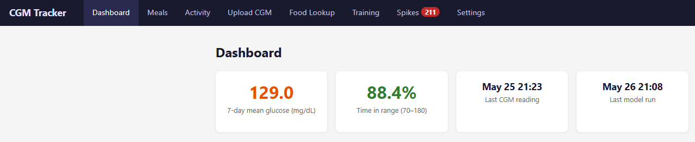
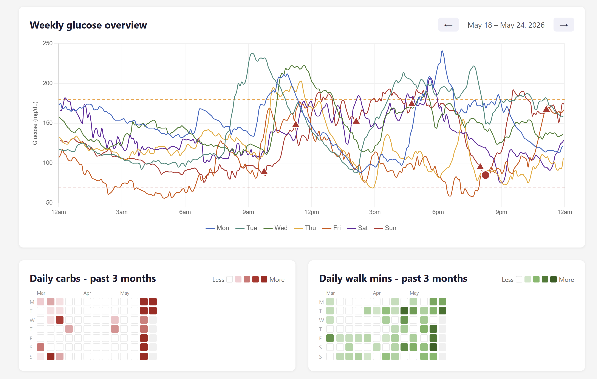
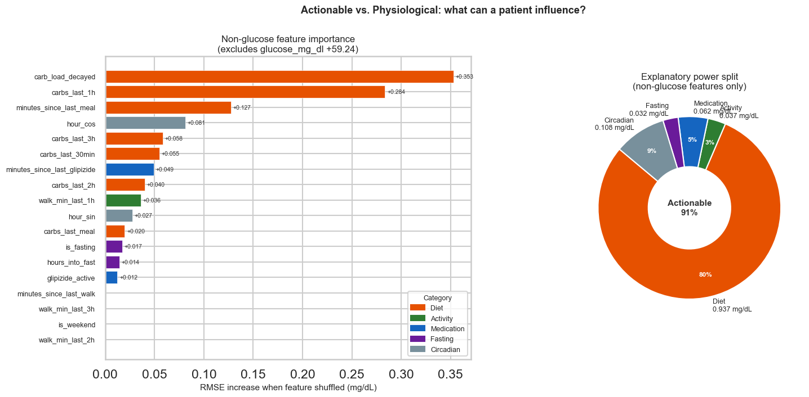
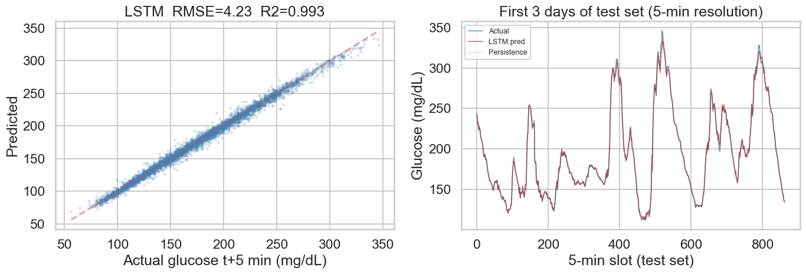

# personal-cgm-lab

A personal glucose modeling project built on my own CGM data, South Indian meal log, and walking records. UC Berkeley ML/AI capstone, n=1.

> **In brief:** Nearly four months of personal CGM data (29,557 five-minute readings, 343 meals, 72 walks). Seven models compared on a 21-day held-out test set. Best per-meal model: Random Forest, RMSE 31.6 mg/dL. Best time-series model: LSTM hourly, RMSE 23.3 mg/dL (beats the persistence baseline by 16%). The finding that changed my behaviour: a 25-minute post-meal walk reduces the predicted peak by ~3.8 mg/dL. In an effort to collect more data, walked more after meals and my 7-day mean glucose fell from 170 -> 132 mg/dL over the project period.

---

## Contents

- [Why I built this](#why-i-built-this)
- [What I'm trying to figure out](#what-im-trying-to-figure-out)
- [Key findings](#key-findings)
- [What this actually means for me](#what-this-actually-means-for-me-plain-language)
- [Status](#status)
- [The web app](#the-web-app)
- [Repo layout](#repo-layout)
- [Quick start](#quick-start)
- [Methods](#methods)
- [Modeling deep-dives](#modeling-deep-dives)
- [Honest limitations](#honest-limitations)
- [What comes next](#what-comes-next)
- [What I learned](#what-i-learned)
- [Glossary](docs/glossary.md)
- [Disclaimer](#disclaimer)

---

## Why I built this

I'm a Type 2 diabetic. Ten months of continuous glucose monitoring and intermittent fasting brought my HbA1c from 10 down to 6.7. I want to reach 6.0, and I've found that generic diabetes apps don't model me well. My diet is rice, lentils, dosa, sambar, and curries. The standard glycemic-index tables were built around a Western plate.

So I built my own. This repo is the data scaffolding for that push: raw glucose readings joined with my food log, walk timing, medication schedule, and fasting windows, with a regression model on top that can actually answer the questions I have at dinner time.

It's n=1 by design. The methods could generalize; the numbers won't.

The data comes from a Stelo CGM (5-min readings), a Google Pixel Watch (activity via Health Connect), a mix of app-logged and manually logged meals, a manually maintained medication schedule, logged fasting windows, and a custom South Indian food nutrition table I assembled myself. Full provenance for each source is in [docs/data-sources.md](docs/data-sources.md).

---

## What I'm trying to figure out

Four questions come up for me every day. Here are the questions and the short answers; the evidence behind each is in [Key findings](#key-findings).

| # | Question | What the data says |
|---|---|---|
| 1 | **Walk dose-response.** Is 25 minutes of walking enough or do I need 45? | 25 min ≈ 3.8 mg/dL off the predicted peak; no further benefit at 45 min in the training data - but that estimate is soft (sparse walk data, now improving). |
| 2 | **Dinner given lunch.** What should I eat for dinner to keep my daily average on target? | Pre-meal glucose at dinner is largely set by the lunch aftermath; carb moderation is the one reliably clean lever. |
| 3 | **Stable vs spiky dishes.** Which foods keep me in range, which blow me up? | After adjusting for context: chai and dosa are stable; "salad" and veg biryani spike more than expected - likely a logging artefact. |
| 4 | **A1C trajectory.** What moves my daily mean toward A1C 6.0 (~125 mg/dL)? | Consistent post-meal walking + carb reduction; mean fell 170 -> 132 mg/dL over the period (see [Status](#status)). |

---

## Key findings

These are the headline results across all models, fitted on data through late April 2026 and evaluated on the last 21 days as a held-out test set.

### All-model comparison

| Model | Test RMSE | Test R² | Notes |
|---|---|---|---|
| Ridge (per-meal) | 33.86 mg/dL | 0.152 | Best generalising tabular model |
| Random Forest (per-meal) | 31.58 mg/dL | 0.262 | Best single per-meal model overall |
| GBM (per-meal) | 34.80 mg/dL | 0.104 | Badly overfit; train R²=0.91 |
| SARIMAX daily | flat forecast | - | All exog p > 0.6; carb invisible at daily resolution |
| SARIMAX hourly | 41.4 mg/dL | - | Beats naive (48.0); carb signal clean |
| LSTM per-meal | 33.97 ± 0.3 mg/dL | ~0.170 | Competitive with Ridge; sequence input |
| LSTM hourly | 23.31 ± 0.19 mg/dL | ~0.77 | Beats persistence baseline (27.71) |
| LSTM 5-min | 4.19 ± 0.02 mg/dL | ~0.993 | Beats persistence (4.84); near real-time |

*For context: an RMSE of ~35 mg/dL spans roughly the gap between a normal pre-meal reading (100) and a moderate post-meal spike (135). These models are best used to rank behavioral choices, not to predict an absolute glucose number.*

**Walk dose-response.** A 25-minute walk within 90 minutes of a meal reduces the predicted peak excursion by about 3.8 mg/dL compared to no walk, holding carb load and pre-meal glucose constant. Extending to 45 minutes adds no further predicted benefit in the training data - but that estimate is soft, since only 48 walked meals were in the original training set. Post-submission I have been walking 40+ minutes after every meal, and the accumulating data will eventually test whether that plateau was a data artefact or physiology.

**Pre-meal glucose is the dominant predictor.** Both the Ridge coefficients and the SHAP summary agree: where my glucose starts before a meal is the strongest single driver of how high it peaks. Carb load and time of day follow behind it. Walk minutes matter but rank lower, which reflects the sparse walk data in the original training window.

**Dish ranking (adjusted).** Using the model residuals to rank dishes removes the confounding from when and how I tend to eat each food. Chai and dosa tend to spike less than their raw averages suggest - they often appear at breakfast when pre-meal glucose happens to be lower. Meals logged as "salad" or veg biryani carry positive residuals, meaning they spike more than the model expects given their context - likely a logging artefact (hidden carbs in dressings, larger portions than assumed) rather than a property of the dish itself.

**Hourly SARIMAX.** The carb signal that was invisible at daily resolution became identifiable at hourly: `carb_load_decayed` (tau=75 min exponential decay) has a coefficient of +0.137 mg/dL per g-equivalent (p < 0.001). Multi-step RMSE across the 21-day holdout is 41 mg/dL vs 48 for the naive mean baseline. Walk effect is correctly signed but not significant given the sparse walk data. The medication variable is confounded with the diurnal glucose pattern and cannot be cleanly identified. Full analysis -> [notebook 03](notebooks/03-sarimax-hourly.ipynb).

**LSTM hourly.** Beats the persistence baseline (23.31 vs 27.71 RMSE, ~0.77 R²) with the advantage concentrated specifically during post-meal windows - which is the clinically meaningful window. Persistence says "glucose stays the same"; the LSTM has learned that it doesn't, especially in the 60 minutes after eating.

**LSTM 5-min.** At five-minute resolution, the persistence baseline is extremely strong (RMSE 4.84, R²=0.990) - glucose really doesn't change much in five minutes most of the time. The LSTM still beats it (RMSE 4.19, R²=0.993), and its advantage again concentrates post-meal. The permutation importance result is humbling: current glucose contributes +59 mg/dL to RMSE when permuted; carbs, walks, and everything else combined contribute about +0.35 mg/dL. A 170:1 ratio. The model mostly learned "glucose will be close to what it is now." That turns out to be almost always correct. The remaining 1 part in 170 is where the actionable features live.

**Plain regression on hourly data is a trap.** A behavior-only regression barely beats guessing the mean (test RMSE 46 vs 48) with severely autocorrelated residuals. Adding "glucose one hour ago" inflates apparent accuracy (RMSE 24) but collapses to worse-than-baseline (RMSE 64) once it must forecast forward without the true recent reading. A gradient booster does no better and draws 80% of its predictions from the lag, not behavior. The takeaway: glucose is momentum-dominated, carbs are the one consistently trustworthy lever, and the per-meal model is the right tool for actual decisions. Full demonstration -> [notebook 04](notebooks/04-regression-hourly.ipynb).

---

## What this actually means for me (plain language)

Stripping out the statistics, here is what four months of my own data is telling me.

**"How good is the model?" decoded.** When I say a model explains 7% or 74% of the variation, the plain version is this: the dumbest possible forecast is "tomorrow will equal my three-month average." A model explaining 7% is barely better than that dumb guess. A model explaining 74% sounds great - but that number only appears when the model is quietly handed my actual recent reading. Take that away (which is the situation whenever I am planning ahead) and every model I built falls back to roughly the dumb-guess line, or worse.

**The single biggest finding: glucose has momentum.** By far the strongest predictor of my glucose in any hour is my glucose the hour before. Food, walking, fasting, and medication timing all matter, but their effect is small next to sheer momentum and my daily rhythm (higher through the day, lower overnight). There is no single behavioral magic lever in this data that swamps that momentum. Intermittent fasting helps, and walks immediately after meals keep the post-meal spikes contained.

**What I can actually trust:**

- **Carbs are the one lever that shows up clean every single time.** Across every model and every variation, more carb load -> higher glucose, correct direction, never ambiguous. This is the most reliable, actionable result in the whole project.
- **The per-meal view is the trustworthy one.** When I ask "what will *this* meal do to me," the per-meal model gives an answer I can rely on, because it measures the *jump* from wherever I started, not the absolute number. That is the model to consult at the table - not the hourly forecasts.
- **Walking helps, but I cannot put a precise number on it yet.** Every hourly model got the walk effect muddied, partly because I tend to walk *after* meals I expect to spike, so the data makes walking look associated with high glucose. The per-meal estimate (a ~25-minute walk ≈ a few mg/dL off the peak) is the best I have, and even that is soft.

**The result that matters most: I started walking more.** After the first model submission, I took the walk dose-response estimate seriously and started walking more than 40 minutes after every meal - more consistently and for longer than before. The data since then tells the story: my 7-day glucose average is now around 132 mg/dL, compared to 170 mg/dL across the full period. The target for A1C 6.0 is roughly 125 mg/dL. I am not there yet, and I do not have enough post-intervention data to model this properly - but the direction is exactly right.

There is something both satisfying and slightly absurd about this outcome. I built a fairly involved ML pipeline, ran eight notebooks, tried five different modelling approaches, and the most important result is: walking consistently after meals works. Every doctor has said this. I came here looking for a magical answer and the beauty is that the lack of data guided me to it. The data just made me actually do it.

**Practical recommendations for myself:**

1. **Treat carbs as the primary dial.** It is the one input the data agrees on without exception. For pushing toward A1C 6.0, consistent carb moderation pays off more predictably than any other single change.
2. **Use the per-meal model for decisions, not the trajectory forecasts.** "Should I walk after this dinner?" -> per-meal model, good answer. "What will my average be in three weeks if I do X?" -> no model here answers that reliably; do not over-trust any number that claims to.
3. **Consistency beats heroics.** Because glucose carries so much momentum, a steady run of moderate days moves my average more than occasional dramatic interventions wedged between ordinary ones. Smoothing out the bad days matters more than perfecting the good ones.
4. **To learn the walk effect properly, I would have to randomize it.** Walking only when I feel I need to permanently contaminates the data. A few weeks of deciding by coin-flip whether to walk after a meal would teach me more than any further modeling of what I already have.
5. **None of this replaces my endocrinologist.** These are day-to-day decision aids, not a treatment plan.

---

## Status

Nearly four months of data: February 1 through May 26, 2026. 29,557 five-minute readings.

| metric | value |
|---|---|
| mean glucose (full period) | 170.3 mg/dL |
| 7-day mean glucose | 132.2 mg/dL |
| time-in-range 70–180 (full period) | 61.0% |
| time-in-range 70–180 (most recent 7 days) | 88.4% |
| GMI estimate (full period) | ~7.4 |
| logged walks | 72 |
| meal events | 343 |



The 7-day mean of 132 mg/dL is worth calling out separately. After the first model submission, I started walking more than 40 minutes after every meal - partly to test the model's prediction, partly to collect better walk data. My overall glucose average has been tracking close to 130 for the most recent weeks. The target is ~125 mg/dL (A1C 6.0). I don't have enough post-intervention data to model this properly yet - a few weeks of consistent behaviour doesn't constitute a new training regime - but the direction is exactly right and I intend to keep collecting.

---

## The web app

Partway through the project it became clear that logging meals in a spreadsheet was friction I would eventually stop tolerating. So I built a small personal tracking web app - FastAPI backend, SQLite database, served from a Docker container on a machine at home - to replace the spreadsheet entirely. It handles meal, activity, medication and fasting logging, CGM import from the Stelo export, a weekly glucose dashboard, a spike-review queue, and a one-click training pipeline that rebuilds the feature matrices and refits the models from the browser. I built it with generative-AI assistance, guided by the scripts already used in the notebooks.

The app itself is outside the scope of this capstone, but it directly contributed to the results. A low-friction way to log a meal immediately after eating - phone browser, thirty seconds - meant I actually logged every meal in the last stretch closer to real time, with more detail. More complete, more timely data is part of why the recent numbers look better: the model got better inputs, and I got better feedback. These are not separable.



---

## Repo layout

```
.
├── data/
│   ├── raw/                        source CSVs, version-controlled
│   │   ├── cgm_5min.csv            5-min glucose readings
│   │   ├── meals_v2.csv            logged meal events
│   │   ├── activities.csv          walk events with duration
│   │   ├── medications.csv         scheduled doses, one row per dose
│   │   ├── fasting_windows.csv     overnight and IF windows
│   │   ├── food_lookup.csv         custom South Indian dish nutrition table
│   │   └── raw_export_stelo.csv    original Stelo export (not committed)
│   └── processed/                  feature matrices, rebuilt from raw
│       ├── per_meal_features.csv   one row per meal (target: peak_delta)
│       ├── daily_features.csv      one row per physiological day (4 AM boundary)
│       ├── hourly_features.csv     one row per hour (target: glucose_hourly_mean)
│       └── cgm_5min_features.csv   one row per 5-min reading (target: next glucose)
├── scripts/
│   ├── 00-build-features.py        reads data/raw/, writes per_meal + daily features
│   ├── 01-build-hourly.py          reads data/raw/, writes hourly_features.csv
│   └── 02-build-5min.py            reads data/raw/, writes cgm_5min_features.csv
├── notebooks/
│   ├── 00-exploratory-data-analysis.ipynb
│   ├── 01-regression-model.ipynb
│   ├── 02-sarimax-model.ipynb      daily SARIMAX (contrast case)
│   ├── 03-sarimax-hourly.ipynb     hourly SARIMAX with glipizide comparison
│   ├── 04-regression-hourly.ipynb  Ridge/GBM on hourly data (autocorrelation pitfall)
│   ├── 05-lstm-per-meal.ipynb      LSTM on pre-meal CGM sequence -> peak_delta
│   ├── 06-lstm-hourly.ipynb        LSTM next-hour forecasting; beats persistence
│   └── 07-lstm-5min.ipynb          LSTM next-5-min forecasting; feature importance
├── models/                         serialized model artifacts (.joblib, .pkl, .pt),
│                                   rebuilt by the scripts; not version-controlled
└── README.md
```

The CSVs in `data/raw/` are the editable layer. The processed feature matrices are fully reproducible from a single script run. For a full column-by-column description of all feature matrices, see [docs/data-dictionary.md](docs/data-dictionary.md).

*Note: the raw data files are personal health records, included for completeness of the submission but not licensed for redistribution. To run this pipeline on your own Stelo export, replace the files in `data/raw/` with your own.*

---

## Quick start

```bash
# Build the per-meal and daily feature matrices
python scripts/00-build-features.py

# Build the hourly feature matrix (needed for notebooks 03, 04, 06)
python scripts/01-build-hourly.py

# Build the 5-min feature matrix (needed for notebook 07)
python scripts/02-build-5min.py
```

Dependencies: pandas, numpy, scikit-learn, shap, matplotlib, seaborn, pyarrow, torch (CPU build is fine for all LSTM notebooks).

Then open the notebooks in order:

- [00-exploratory-data-analysis.ipynb](notebooks/00-exploratory-data-analysis.ipynb) - data quality checks, EDA, feature validation, stationarity tests, hourly feature visualizations
- [01-regression-model.ipynb](notebooks/01-regression-model.ipynb) - Ridge + GBM, SHAP, walk ROI counterfactuals, confounder-adjusted dish ranking
- [02-sarimax-model.ipynb](notebooks/02-sarimax-model.ipynb) - daily SARIMAX (contrast case; shows why daily resolution fails)
- [03-sarimax-hourly.ipynb](notebooks/03-sarimax-hourly.ipynb) - hourly SARIMAX, carb signal recovery, glipizide confounding experiment, counterfactual scenarios
- [04-regression-hourly.ipynb](notebooks/04-regression-hourly.ipynb) - Ridge/GBM on hourly data; demonstrates the autocorrelation pitfall (no-lag vs lag, oracle vs recursive)
- [05-lstm-per-meal.ipynb](notebooks/05-lstm-per-meal.ipynb) - LSTM on 2-hour pre-meal CGM sequence; data augmentation experiment; hybrid LSTM+tabular architecture
- [06-lstm-hourly.ipynb](notebooks/06-lstm-hourly.ipynb) - LSTM next-hour forecasting with 17 exogenous features; beats persistence; post-meal window analysis
- [07-lstm-5min.ipynb](notebooks/07-lstm-5min.ipynb) - LSTM next-5-min forecasting; 19 features; actionable vs physiological feature importance

---

## Methods

**Feature engineering.** The build script joins CGM readings, activity, medications, and fasting windows to each meal event by timestamp proximity. Key derived features include 30 and 60-minute pre-meal glucose averages, glucose velocity in the 30 minutes before eating, walk minutes in 60/90/180-minute windows after the meal, minutes since the last Glipizide dose, and whether the meal broke a fasting window. Daily features are aggregated on a physiological-day boundary (4 AM) so that an overnight fast stays on a single date rather than splitting across two calendar days. Lag and rolling-window features are built with a deliberate shift to avoid leaking tomorrow's glucose into today's training features.

**Regression.** I fit the per-meal models on a temporal train/test split, holding out the last 21 days as a test set. No random shuffling; CGM readings are autocorrelated and shuffling would leak future context into training. A Ridge baseline with time-series cross-validation, a HistGradientBoostingRegressor tuned with GridSearchCV, and a Random Forest. SHAP values from the gradient booster show which features are actually driving predictions.

**Counterfactuals for walk ROI.** For each held-out meal, I re-predict at fixed `walk_min_within_90` values of 0, 15, 25, 30, 45, and 60 minutes while holding everything else constant. The resulting dose-response curve answers the "how many minutes do I actually need" question with an estimate from my own data rather than population averages.

**Confounder-adjusted dish ranking.** Raw peak_delta averages by dish are confounded: chai appears at breakfast when cortisol is rising, rice at lunch when I'm already walking more. The model controls for time-of-day, pre-meal glucose, fasting state, and recent walks. Ranking dishes by their mean residual (actual minus predicted) removes those confounders and gives a cleaner read on which foods are specifically driving spikes versus which ones happen to be eaten in high-spike contexts.

---

## Modeling deep-dives

The full derivations live in the notebooks; this is the map.

**Time-series (SARIMAX) -> [notebook 02](notebooks/02-sarimax-model.ipynb), [notebook 03](notebooks/03-sarimax-hourly.ipynb).** Daily resolution failed immediately: a 30-minute walk is 2% of a day and indistinguishable from noise, so every exogenous coefficient came back insignificant and the forecast was nearly flat. Rebuilding at hourly resolution (2,076 hours) recovered the carb signal cleanly - `carb_load_decayed` at +0.137 mg/dL per g-equivalent (p < 0.001), multi-step RMSE 41 vs 48 naive. Walk stayed correctly signed but underpowered. The notebook also documents a **glipizide confounding experiment**: the medication flag tracks daytime hours and `is_fasting` tracks nighttime hours, so the two are nearly anti-correlated along the diurnal cycle and cannot be causally separated even after adding explicit `hour_sin`/`hour_cos` controls.

**Deep learning (LSTM) -> [notebook 05](notebooks/05-lstm-per-meal.ipynb), [notebook 06](notebooks/06-lstm-hourly.ipynb), [notebook 07](notebooks/07-lstm-5min.ipynb).** Glucose has temporal memory - the plateau from a big rice lunch still pulls up my post-dinner reading hours later - so I moved to an architecture designed for sequences. Three experiments: the **per-meal** LSTM reads the 2-hour pre-meal CGM trajectory and ties Ridge (RMSE 33.97 ± 0.3), with a data-augmentation experiment that made things *worse* at every multiplier; the **hourly** LSTM beats persistence (23.31 vs 27.71), with the gain concentrated in the post-meal window where it matters; the **5-min** LSTM reaches RMSE 4.19 and surfaces the project's most striking result - current glucose outweighs every behavioral feature combined by roughly 170:1.





**Why not just a plain regression on the hourly data? -> [notebook 04](notebooks/04-regression-hourly.ipynb).** Three models built specifically to demonstrate the autocorrelation trap. Behavior-only regression barely beats the mean (RMSE 46 vs 48, Durbin-Watson 0.51). Adding "glucose one hour ago" looks transformative (RMSE 24) but collapses to RMSE 64 - worse than guessing the mean - once it must forecast forward on its own predictions. A gradient booster does no better and draws 80% of its weight from the lag, not behavior. The unifying lesson: any model handed the recent reading looks brilliant and learns nothing about behavior; any model denied it looks useless. That is exactly why the per-meal model is the workhorse for "what should I do" questions - it measures each meal's rise from its own baseline rather than the absolute level.

---

## Honest limitations

**n=1.** Nothing here generalizes to other people. The methods are reusable; the coefficients are not.

**Sparse walk data (improving).** The original training window had only 48 walks. Post-submission, walking 40+ minutes after every meal has increased the activity log to 72 events and counting. The dose-response curve above 30 minutes was largely extrapolation in the first model; a retrained model on the expanded dataset will test whether that plateau holds.

**Selection bias on walks.** I tend to walk after meals where I expect a spike, not randomly. Even controlling for carbs and pre-meal glucose, unmeasured expectation is correlated with the walk decision. A few weeks of coin-flip randomization would produce cleaner evidence than any regression on this dataset.

**Small n for deep learning.** The LSTM per-meal model trains on ~200 sequences. That is genuinely small for a neural network, and the multi-seed evaluation in notebook 05 shows the variance is non-trivial. The hourly and 5-min LSTMs have more sequences (1,500+ and 20,000+ respectively) and are more stable. With more months of data the per-meal LSTM will be worth revisiting.

**Confounders not captured:** stress, sleep quality, hydration, exact medication onset time relative to eating. Their absence shows up as residual variance in the model.

---

## What comes next

### 1. More data, better models

The most important thing I can do is keep collecting. Seven more months of consistent logging - meals, walks, CGM - would roughly triple the dataset and bring the per-meal LSTM into a range where its results are actually trustworthy. With more data, the walk dose-response curve above 30 minutes stops being extrapolation and becomes something I can actually rely on at dinner time.

On the modeling side, two papers are on the reading list. Namazi & Shakeri's *"From Prediction to Practice: A Task-Aware Evaluation Framework for Blood Glucose Forecasting"* ([arXiv:2605.00645](https://arxiv.org/abs/2605.00645)) reframes the evaluation problem entirely - rather than minimizing aggregate RMSE, it asks whether a forecasting model is actually useful for specific clinical tasks like hypoglycemia early warning. That framing fits this project well: the question was never "what RMSE can I achieve" but "what should I eat tonight." A second paper on LSTM architectures for CGM forecasting ([medRxiv:2024.02.08.24302542](https://www.medrxiv.org/content/10.1101/2024.02.08.24302542v1)) is on the list for techniques that might improve the per-meal sequence model specifically.

### 2. Reach out for more data

The hardest constraint in this project is n=1. A paper by researchers studying glucose dynamics in a South Asian dietary context ([preprints.org:202309.0755](https://www.preprints.org/manuscript/202309.0755)) covers a population whose food patterns overlap significantly with mine - rice-based meals, lentils, the glycemic profile of a South Indian plate rather than a Western one. I intend to contact the authors to ask whether their dataset is available for modeling work, or whether there is appetite for a collaboration. Even a small multi-subject dataset with similar dietary patterns would let me test whether any of the coefficients here generalize beyond one person.

### 3. Close the logging loop with direct API integration

Right now the data flow has two manual steps: exporting from the Stelo app and uploading the CSV, and manually entering meals into the web app. Both are low friction but not zero friction. The Stelo/Dexcom and Google Health Connect APIs exist; wiring them up would make the pipeline fully automatic - CGM readings and walk data land in the database as they happen, with no export or upload step. That would also enable near-real-time spike detection and feedback rather than end-of-day review.

### 4. Stretch - mobile logging with image-based food recognition

The remaining friction is meal entry. Typing "low gi basmati rice, 60g" is fine when I'm at a desk; less so mid-meal. A lightweight mobile companion that lets me photograph a plate and have a vision model estimate the dish and carb content would close that gap. The custom South Indian food lookup table I built is a head start: the image recognition output just needs to be mapped onto that table rather than a generic Western nutrition database. This depends on how well the core data collection holds up first, but the pieces are mostly in place.

---

## What I learned

After 5 months in the course, the modeling was the straightforward part. Getting the data into a shape the model could actually use was where most of the real work happened.

I came into this project thinking the hard problem was picking the right algorithm. It turned out the hard problem was much earlier: the raw Stelo export arrives in a format designed for their app, not for analysis. Timestamps are in one format, dates in another. Activity data comes through Health Connect with its own schema. Meal records are partially logged in the app and partially maintained outside in a ledger. Medication records needed to be generated from scratch and maintained manually. None of these sources were designed to be joined to each other.

The discipline that forced was something I wouldn't have learned from a clean classroom dataset off of Kaggle. Every modeling decision downstream traces back to a data decision upstream. The 4 AM physiological-day boundary exists because I noticed overnight fasts were splitting across calendar dates and distorting the daily averages. The `carbs_g_final` priority chain exists because three different sources each have partial coverage and none is authoritative on its own. The `taken` column bug (boolean `True` stored as the string `'TRUE'` in one path, an actual bool in another) was silent - the model ran fine, it just treated every meal as if no medication had ever been taken.

The second thing I learned was about choosing the right architecture for the right question. SARIMAX captured the carb signal that plain regression missed entirely, but it struggled with the sparse walk data and the Glipizide confounding. Moving to LSTM was driven by a specific observation: glucose has temporal memory, and architectures designed for sequential data should respect that. Seeing how LSTM cell state carries context across long sequences - not just "what happened last step" but "what happened 20 steps ago and is still relevant now" - made the switch feel principled rather than just trying the next thing on the list. I skipped RNN and went straight to LSTM but perhaps will try it out later.

Sourcing your own data removes the safety net of a pre-cleaned dataset. There is no answer key. When something looks wrong, you have to decide whether the data is bad, the feature engineering is wrong, or the biology is actually doing something unexpected. That judgment call is most of what data work actually is, and I don't think I would have developed it the same way working on someone else's almost-already-tidy CSV.

---

## Glossary

Clinical and ML/statistics terms are defined in [docs/glossary.md](docs/glossary.md).

## Disclaimer

This is a personal research project for an academic capstone. It is not medical advice, not a clinical tool, and not validated for use by anyone other than me. If you are diabetic, talk to your endocrinologist.

## License

MIT (code). The data files in `data/*` are personal health records belonging to the author and are not shared under any open data license. Including them here for completeness of my capstone project. If you want to use this, please email the author to seek permission.
